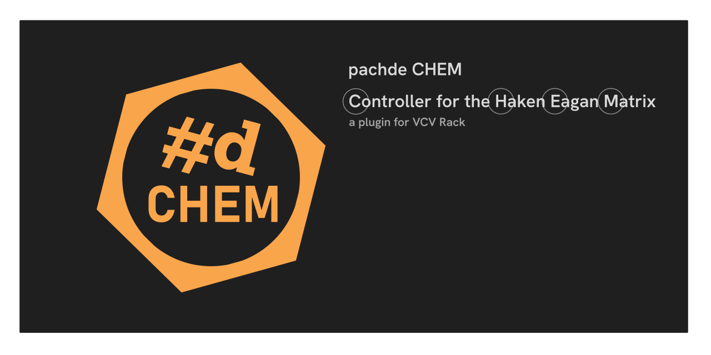

# pachde-CHEM

CHEM (**C**ontroller for the **H**aken **E**agan **M**atrix) is the successor to #d **HC One**.
Haken EaganMatrix firmware version 10.40 added many features and improvements to the MIDI protocol.
The changes are big enough to warrant a redesign of the modularization and user interface, hence a new plugin.

Read the [Documentation](./doc/index.md) for information on **#d CHEM**.

> **Note** –
> Pachde and **CHEM** are not officially affiliated with or sponsored by Haken Audio or Expressive E.

## Acknowledgements

Special thanks to Lippold Haken (and the Haken Audio team), for creating the Continuum family of devices.
Lippold personally has provided generous support by sharing internal technical details that make this software possible.

Special thanks to Richard Kram for encouragement, stellar docs, and testing.

## Appreciation

The pachde line of software for Eagan Matrix devices is a labor of love. The products are free to use.
Creating them requires an large investment of time and $$.
You can show appreciation for the value these tools bring to your music-making, buy making a donation or leaving a tip.

I dream of making standalone versions with responsive touch controls suitable for live performance, available for the major platforms with touch support, such as iOS, Android, and Windows. This requires an investment in $$ for the hardware, tools, and SDK licensing. Any donations you make go towards funding these prerequisites.

[Click to Show appreciation (VenMo)](https://venmo.com/u/pcdempsey). \
Thank you!

## License

This repo is nominally MIT-licensed.

If you make a derivative work using this source code for profit, a contribution back to the author would be appreciated so that this kind of work can continue.
Even though the license does not create a legal obligation to do so, it's just the right thing to do.

All graphics and documentation are Copyright (c) Paul Chase Dempsey.

This software uses the Haken Audio Midi Protocol by Lippold Haken, (C) Copyright 1999-2024.

---

// Copyright © Paul Chase Dempsey\

