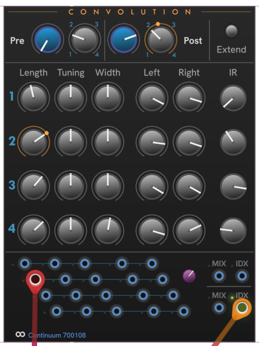

# CHEM Convolution

**Convolution** controls convolutions, both pre- and post- effects convolution.

The Blue knobs control the mix between the dry and processed signal for the pre-effects and post-effects convolutions.

The gray **Index** knob chooses from the four convolution impulse responses (IRs).
An intermediary value provides an interpolation between the adjacent IRs.
Modulating the index can be an effective way to add movement to the timbres produced by a preset.

Right click an **IR** knob to see a menu of IR data, or turn (drag) the knob to move through the options.

For each of the 4 convolutions you can choose the parameters for applying the IR to the signal (*Length*, *Tuning*, and *Width*), the *Left* and *Right* strength, and which impule-response data to use.
Modulating *Length*, *Tuning*, and *Width* can introduce artifacts, so should be used sparingly or controlled using fixed voltages.

The **Extend** button enables extended computation, which increases the quality at the expense of DSP usage.

The modulation inputs and **Modulation amount** knob work the same across all CHEM modules.
See [CHEM Modulation](./modulation.md) for details.

---

// Copyright © Paul Chase Dempsey\

