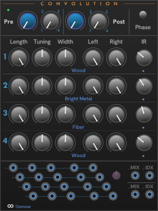

# CHEM Convo

**Convo** contains controls for comvolutions, both pre- and post- effects convolution.

The Blue knobs as always control the mix between the dry and processed signal, for the pre-effects, and post-effects IRs.
The gray **Index** knob chooses from the four convolution impulse response (IR).
An intermediary value provides an interpolation between the adjacent IRs.

For each of the 4 convolutions (selected by the lollipop control to the left) you can choose the IR,  parameters for applying that IR to the signal, and the left/right strength.

The Pre- and Post- Mix and Index parameters can be CV-modulated.

---

// Copyright © Paul Chase Dempsey\

