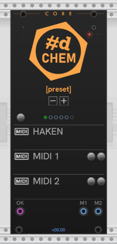
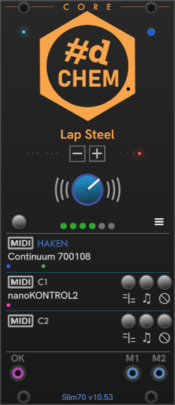

# CHEM Core

The **Core** module is essential.
It maintains the MIDI connection and handles all communications with an Eagan Matrix device. All the other modules must be paired with a **Core**.

| | |
| -- | -- |
| Unconnected -- freshly added to Rack | Core connected to a Micro, with a ContinuuMini and a Korg nanoKONTROL2 as controllers. |
|  |  |

Press the **HAKEN** MIDI button to choose from the Eagan Matrix devices that are connected to the computer.
Once you've successfuly connected to a device,
the moving dots under the button indicate the transmission MIDI data to and from the device.

The name of the currently selected preset is shown under the **#d CHEM** logo.
The text in the footer shows the type of EM device and the firmware version number.

The **-** and **+** buttons under the preset name move to the previous and next presets, in System order.
You may be surprised that this isn't the same order as the preset movement buttons on the device itself, for system presets. These buttons are sending simple preset movement commands provided by the EM firmware, and this is what they do.

The button above the **HAKEN** MIDI button is the **MIDI Reset** button.
It resets the connection, for use when there may be a connection glitch.
To clear all connections, Ctrl+Click the **MIDI Reset** button.

Use the **MIDI 1** and **MIDI 2** buttons to select a MIDI controller to use with the main **HAKEN** device.
MIDI data from the controller is used by CHEM modules to track the state of the EaganMatrix, and also passed through to the **HAKEN** device.

If the controller is another EaganMatrix device, it can be used only for music data (notes and expression).
 Use the **MIDI FIlter** button to the right of the controller connection to toggle the music data filter.
**Core** attempts to automatically detect Eagan Matrix devices by their name, but this automatic detection may not always work.
For example, when you're routing through a virtual cable.
In these cases, you must make sure the filter is enabled to prevent your EM device from getting confused with data from another EM device.

The **Ready gate** output can be used elsewhere in your patch to know when the EM device is ready and able to accept MIDI and produce sound.
The gate will be high when the EM is ready for input, and low when it is busy, such as when changing presets or enumerating presets on the device.

---

// Copyright © Paul Chase Dempsey\

