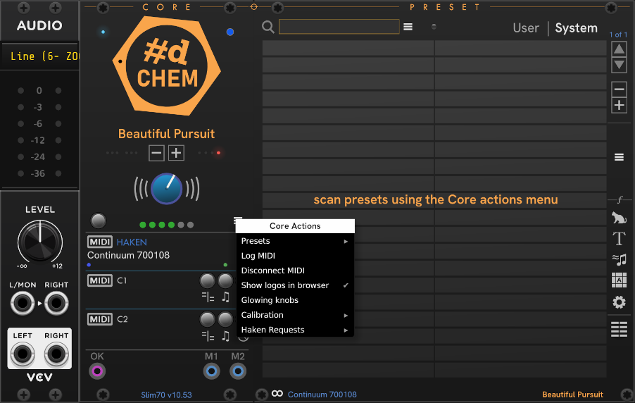
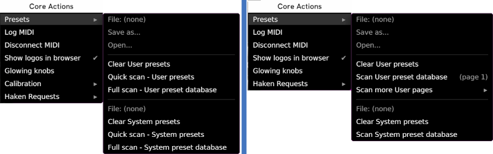
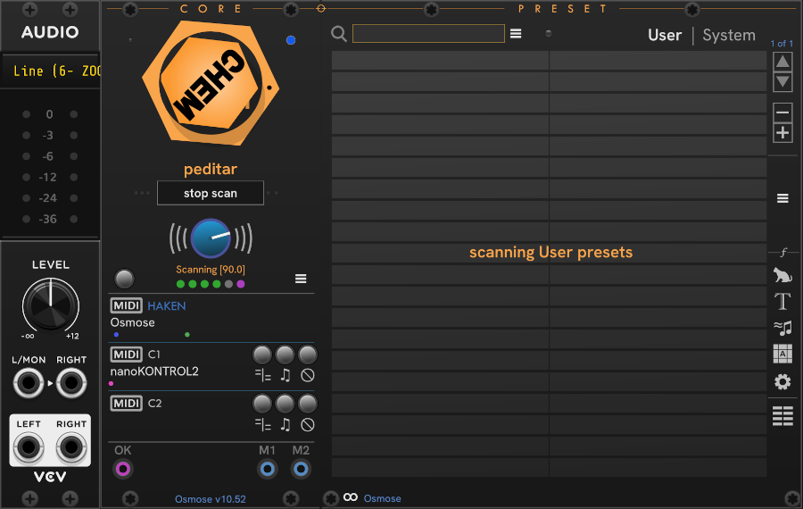

# CHEM Core

The **Core** module is essential.
It maintains the MIDI connection and handles all communications with an Eagan Matrix device. All the other modules must be connected to a **Core**.

MIDI connections usually don't work unless there is also one of the VCV Rack **Audio** modules in the patch and connected to a driver or audio interface.
You don't have actually *use* the audio module, but it must be present and connected.
If you're starting a new Rack patch, add one of the VCV **Audio** modules first, then add a **Core**.

After **Core**, you'll want to scan presets and use **CHEM Preset**, but that's getting ahead of ourselves. Let's focus on **Core**.

**Fig 1.** *Core connected to a Slim70, with a Korg nanoKONTROL2 on C2.*

When added to the patch, Core automatically tries to find a connected EaganMatrix device by name, and connects to the first one it finds.
If you have more EaganMatrix devices, press the **HAKEN** MIDI button to choose from the Eagan Matrix devices that are connected to the computer.
If you're using a virtual cable or intermediate MIDI router, you should be able to add the connection under _Any MiDI device (advanced)_.

Once you've successfuly connected to a device,
the moving dots under the device name indicate the transmission of MIDI data to and from the device.
The text in the footer shows the type of EM device and the firmware version number.

The name of the currently selected preset is shown under the **#d CHEM** logo.

The **-** and **+** buttons under the preset name move to the previous and next presets.
On Haken devices, you may be surprised that this isn't the same order as the preset movement buttons on the device itself.
These buttons are sending simple preset movement commands provided by the EM firmware, and this is what they do.
On the Osmose, if preset databases have been built, they navigate in the sort order that the preset databases are in.

The Big blue knob is Volume — Attenuation on Haken devices, and Post level on Osmose.

The button above the **HAKEN** MIDI button is the **MIDI Reset** button.
It resets the connection, for use when there may be a connection glitch.
To clear all connections, Ctrl+Click the **MIDI Reset** button. **Core** will immediately start scanning for EM devices to connect to.

To control a second EM Device, add another **Core** to the patch.

## Creating preset databases

With a fresh installation of CHEM, or with a new or updated EM instrument, you will want to build User and System preset databases to get full CHEM functionality.
Scanning presets from your instrument is a time-consuming process.
This is best performed when you have sufficient free time.
Scanning System presets on an Osmose can take almost an hour. Haken instruments are faster.

For Haken devices, you can do a Quick scan.
A **Quick scan** is much faster than building a full database, but some metadata such as macro definitions and preset authors will not be available for searching.
A **Full scan** captures complete information about each preset by fully loading it on the device.
This process is much slower than a quick scan, and it is the only type of scan available on Osmose.

It is best to perform preset scanning with a patch containing only:

- Any one VCV Audio (Audio, Audio 8 or Audio 16) module connected to a driver or audio interface.
- CHEM **Core**
- CHEM **Preset**

Scanning will work fine without **Preset** in the patch, but it makes it easier to see when scans are complete and verify success.

Start with a blank VCV patch, and add VCV Audo, CHEM **Core**, and CHEM **Preset**.
Put the CHEM modules next to each other so that they'll connect.
We'll start with User presets, so select the _User_ tab in **Preset**.

Your patch should look similar to this:

Click the **Core actions** hamburger menu, and select the _presets_ submenu.
The menu will be different for Haken and Osmose instruments as shown below, Haken on the left, Osmose on the right:

Choose one of the scanning options presented for **User** presets.

If you haven't saved any User presets on your Osmose yet, you can go ahead and scan system presets: select the _System_ tab in **Preset**, and choose _Scan System Preset database_ from the **Core** _Core actions menu_.
A full preset database for the Osmose takes almost an hour.

For Haken instruments, the Quick scan is fastest, but captures less detail.
On Osmose, Quick scan is not vailable becuase EE made that function unavailable.
A complete System scan can take an hour.

Some presets make sound as soon as they are loaded, so you may hear sound output during a full scan. The Drone presets on the Continuum will play briefly.

A scan in progress looks something like this (here, on Osmose):

While the CHEM logo is spinning, do not to interact with Rack or your instrument.

When scanning User presets (especially on Osmose), if you know the name of the last User preset you can look for it. Choose _Stop Scan_ to cut the scan short when you see that the scan has progressed past that preset.
CHEM doesn't have a way to know how many presets are on the Osmose in advance, so it scans all available slots.

If you stop the scan before CHEM has scanned all presets, the database will be usable, but incomplete.
To get a complete preset database, Use the menu to clear the incomplete database, and repeat the scan process.

Osmose allows for a huge number of user presets. The basic User scan is just the first page of 128 slots.
If you have more user presets saved, you can scan additional pages from 2-5.
If you need more user pages, contact me and I can update CHEM with the ability to scan more.

Once preset databases are available, the Randomize (Ctrl+R) right click menu item will select a random preset.

## Connecting other CHEM modules

Once you have a **Core** in your patch, you're ready to add other CHEM modules.
When you place an unconnected CHEM module side-by-side with a connected one, it will automatically link to the connected **Core**.
Or, you can click the **Link** button at the bottom of the CHEM module to choose from a connected **Core** in the patch.

Once connected, you can move the module elsewhere in the patch or to a different row, and they will stay connected (unlike other Rack extender modules).

## MIDI Controllers

Use the **C1** and **c2** buttons to select a MIDI controller to use with the main **HAKEN** device.
MIDI data from the controller is used by CHEM modules to track the state of the EaganMatrix and also passed through to the **HAKEN** device.
If you use an external MIDI controller _without_ routing through CHEM, changes made by the external controller are not reflected in the CHEM modules.
This isn't disastrous -- changing presets or sending new values will sync back up -- but it could be confusing or cause undesirable sound glitches, so best to route the controller through **Core**.

The three round buttons to the right of the controller, are **Channel map**, **Midi fFilter**, and **Data**.

- **Channel Map** — If the controller is another EaganMatrix device with a playing surface, it can be used only for music data,
and if configured for MPE/MPE+ it is necessary to engage the map.
When engaged, music information on channels 2+ are reflected to channels 15-.
This helps avoid unwanted note collisions and allows the playing of both surfaces simultaneously.
The button led will light when the filter is engaged.

  Core attempts to automatically detect Eagan Matrix devices by their name, and enable both the **Channel map** and **Music filter**, but this automatic detection may not always work; when you're routing through a virtual cable, for example.
  In these cases, you must make sure the filter is enabled to prevent your EM device from getting confused with data from another EM device.

- **Music Data** — If a controller is an instrument like a Keyboard or other Haken playing surface, it is usually necessary to allow only music data (notes and expression) through to the EM to prevent unwanted side effects from MIDI controls not intended for the EM.
Engage **Music Data** to pass only music data to the EM.
The button led will light when the filter is engaged.

- **Data**  — When engaged (the red light on the button is on), **Data** blocks the controller and does not pass MIDI to the device.
This effectively "mutes" that controller, so you can turn it on and off as needed without having to disconnect and reconnect.

## Outs and Ins

The **OK** output (the purple port, a.k.a. _Ready gate_) can be used elsewhere in your patch to know when the EM device is ready and able to accept MIDI and produce sound.
The gate will be high when the EM is ready for input, and low when it is busy with a time-consuming operation such as loading or enumerating presets or remaking Mahling data.

The **M1** and **M2** input ports (blue ports) are gate inputs to turn the corresponding controller's data stream off and on.
When the gate is high, the controller is blocked (muted), and the corresponding button led is lit.

## Additional options

There are a few additional options in the hamburger menu:

| Menu Item |  Description |
| -- | -- |
| Log midi | Keeps a log file of the MIDI sent and received by Core. This is used for debugging CHEM, and other peeking under the hood to see what happened in a session. The log file is saved in the pachde-CHEM folder under your Rack user folder. |
| Show logos in Browser | CHEM shows a logo on every panel in the module browser by default. You can turn this off if you find that it's a bit too much. |
| Glowing knobs | The Volume knob stays bright in a darkened room. |
| Haken requests | Send some basic Haken MIDI requests. Hopefully you won't need to use these, except as part of diagnosing a problem.  |

---

// Copyright © Paul Chase Dempsey\

