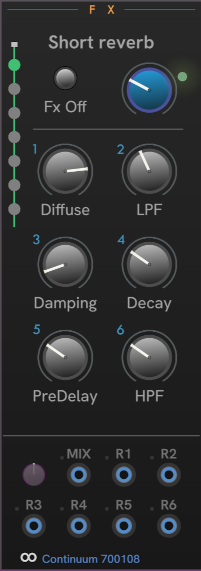

# CHEM Fx

The **Fx** module controls the effects section of the Eagan Matrix, which Haken Audio calls the recirculator.

Chosse which effect is applied using the lollipop control on the left.

The Blue knob controls the mix of straight signal with the effect.

The **Fx Off** button turns off the effects section.
This is the same as "Disable Recirculator" in the Haken Editor's Global and MIDI Settings.

The modulation inputs and **Amount** knob work the same across all CHEM modules.
See [CHEM Modulation](./modulation.md) for details.

---

// Copyright © Paul Chase Dempsey\
