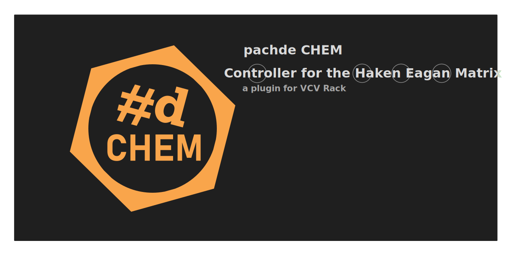

# pachde CHEM

**CHEM** is the successor to pachde **HC One**, for EaganMatrix devices running firmware 10.4x.

**Note** – Pachde and **CHEM** are not officially affiliated with or sponsored by Haken Audio or Expressive E.

If you own more than one Eagan Matrix device, add an instance of **Core** for each device you want to control.
Each other module must be connected to a Core module, using the link button in the module footer.

| Module | Description |
| -- | -- |
| [**Core**](./core.md)  | An instance of Core must exist in the patch. It provides the connection to an EaganMatrix device for the rest of the modules. Certain Eagan Matrix utility functions are available in the right-click menu. |
| [**Play**](./play.md)  | Manages playlists -- files of shortcuts to your favorite presets. Each playlist is for a specific device, so take care when you own more than one. |
| [**Macro**](./macro.md) | Tha main i-vi macro controls. |
| [**Pre**](./pre.md)   | The pre-master section controls, with general pre-effects level, and controls for the Compressor/Tanh. Pre-section convolution controls are in the Convolution module. |
| [**Fx**](./fx.md)    | The "effects", a.k.a. Recirculator section. |
| [**Post**](./post.md)  | The post- master section controls, including a global Mute, post level (Volume), and EQ. Post-section convolution controls are in the Convolution module.|
| [**Convo**](./convo.md) | Controls for pre- and post- convolutions. |
| [**Jack**](./jack.md)  | Pedal assignment, min/max settings and jack output CV. |

More modules are planned to cover other important controls, such as rounding and polyphony,
and a means to address macros 7-90 (which has interesting challenges in the context of VCV Rack).

We take requests! Open an issue on the GitHub repository,
 or get in touch with me on the VCV Rack Community forum or on Discord — where I go by "pachde" — or on Facebook — where I am Paul Dempsey.

## Themes

**CHEM** is thoroughly themeable, and comes with the following themes, selectable by right click:

| Theme | Description |
| -- | -- |
| **Dark**   | Default Dark theme. |
| **Light**  | Light theme. |
| **Ice**    | Cool deep blue-green theme. |
| **Mellow** | Cozy warm-toned theme. |
| **Katy**   | Classic Pink teen doll theme. |
| **Wire**   | Dark wireframe theme. |

Any set of adjacent CHEM panels (showing "links" in the module title bar) change themes together in unison.

The setting **Follow Rack theme** does just that: follows the Rack panel preference setting with the **Dark** and **Light** themes.

### Custom themes

If you're adventurous, you can try creating a custom theme.
Each theme is defined a JSON file in the `pachde-CHEM/res/themes` folder.
These are plain-text files you can edit in any text editor.

To make your own custom theme, make a copy of one of the predefined themes and edit away.
**Dark** is the best one to start from becuase it contains an entry for every theme-able element in CHEM.
The name of your theme file should match the "name" item at the top of the JSON file.

If you make a mistake while editing, like a JSON syntax error,
Rack may crash on startup with a diagnostic error message in the log with a hint of what went wrong.
Don't worry, Rack isn't permanently damaged. Just fix the error and try again.

You don't have to restart Rack to see results of each change as you work.
Choose **Hot-reload themes** in the right click menu or press F4 after clicking on a CHEM module.

## Lights Down

For when the lights are down, choose **Glowing knobs** in the right click menu for the knobs to stay bright.

---

// Copyright © Paul Chase Dempsey\
