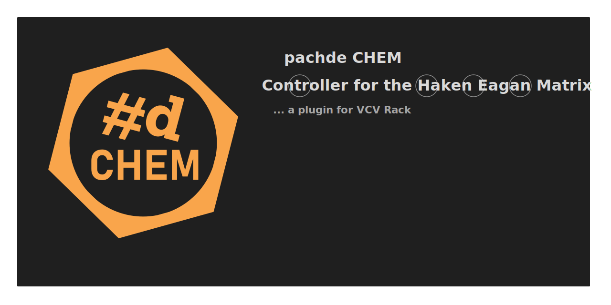

# pachde CHEM

To get started, you must have installed VCV Rack and download the CHEM `.vcvplugin` file from GitHub.
To download and install the latest build, see the [Nightly Release](https://github.com/Paul-Dempsey/pachde-CHEM/releases/tag/Nightly) page.

Start with the [**Core**](./core.md) module.

## Module Index

| Module | Description |
| -- | -- |
| [**Core**](./core.md#CHEM-Core)  | An instance of Core must exist in the patch. It provides the connection to an EaganMatrix device for the rest of the modules. Certain Eagan Matrix utility functions are available in the right-click menu. |
| [**Play**](./play.md#CHEM-Play)  | Manages playlists -- files of shortcuts to your favorite presets. Each playlist is for a specific device, so take care when you own more than one. |
| [**Preset**](./preset.md#CHEM-Preset) | Access to User and System presets on your device. |
| [**Macro**](./macro.md#CHEM-Macro) | Tha main i-vi macro controls. |
| [**Pre**](./pre.md#CHEM-Pre)   | The pre-master section controls, with general pre-effects level, and controls for the Compressor/Tanh. Pre-section convolution controls are in the Convolution module. |
| [**Fx**](./fx.md#CHEM-Fx)    | The "effects", a.k.a. Recirculator section. |
| [**Post**](./post.md#CHEM-Post)  | The post- master section controls, including a global Mute, post level (Volume), and EQ. Post-section convolution controls are in the Convolution module.|
| [**Convolution**](./convo.md#CHEM-Convolution) | Controls for pre- and post- convolutions. |
| [**Jack**](./jack.md#CHEM-Jack)  | Pedal assignment, min/max settings, Octave shift settings, Pedal preservation, and jack output CV. |
| [**Sustain**](./sus.md)  | On-screen Sustain |
| [**Sostenuto**](./sus.md)  | On-screen Sostenuto |
| [**Sostenuto 2**](./sus.md)  | On-screen Sostenuto 2 |
| [**Settings**](./settings.md#CHEM-Settings) | Surface direction, XYZ MIDI assignments, Polyphony, Note processing, Rounding, MIDI routing. |

More modules are planned to address macros 7-90 (which has interesting challenges in the context of VCV Rack).

## Community and Contacts

We take requests! Open an issue on the GitHub repository,
 or get in touch with me online.
You can find me online as *pachde* or *Paul Dempsey* in:

- [VCV Rack Community](https://community.vcvrack.com/) (Discourse)

- [VCV - Discord](https://discord.gg/rhcztE4sZd)

- The *Haken Continuum* and *Expressive E Osmose* Facebook groups

- [Expressive E community - Discord](https://discord.gg/UtMynfPqw7) -- the "official" Osmose Discord monitored by Expressive E.

- [Expressive E instruments - Discord](https://discord.gg/ZjHTgmCR9w) -- a community Discord. (Check out the Eagan Matrix channel).

If you want something more private, you can also get my email contact from the right-click menu of any CHEM module.

## Modulation (voltage control)

The user interface for modulation using voltage control works the same across all the CHEM modules.
See [**CHEM Modulation**](./modulation.md) for details on using CV with CHEM.

## Themes

**CHEM** is thoroughly themeable, and comes with the following themes, selectable by right click in the module menu.
Any set of adjacent CHEM panels change themes together in unison.
Here, we show the **Pre** module modeling the themes against a Light-themed Rack.

| **Dark** | **Light** | **Ice** | **Katy** | **Mellow** |**Wire**   |
| -- | -- |-- |-- |-- |-- |
| Standard default Dark\* | Standard Light\* | Cool deep blue-green | Cotton-candy Pink |  Warm cozy tones | Dark wireframe |
|  |  |  |  |   |  |

\* The setting **Follow Rack theme** in the module menu does just that: follows the Rack panel preference setting with the **Dark** and **Light** themes.

Somewhat related to themes, is that CHEM offers optional screws.
The presence or absence of visible screws is selected in the module menu.
This setting applies to all CHEM modules as a whole.
It isn't selectable per module.
Some CHEM modules don't have room for visible screws, so you have to wedge them in place or use glue or something.
Personally, I've never had one fall out of the skiff.

### Custom themes

If you're adventurous, you can try creating a custom theme.
Each theme is defined in a JSON file in the `pachde-CHEM/res/themes` folder.
These are plain-text files you can edit in any text editor.

To make your own custom theme, make a copy of one of the predefined themes and edit away.
**Dark** is the best one to start from because it should contain an entry for every theme-able element in CHEM.
The filename of your theme file should match the "name" item at the top of the JSON file.

If you make a mistake while editing, like a JSON syntax error,
Rack will crash on startup with a diagnostic error message in the log with a hint of what went wrong.
Don't worry, Rack and your computer are not permanently damaged. Just fix the error and try again.
When working on a theme, it can be helpful to run Rack from the console using the `-d` command-line option (debug mode) to see the log on the console instead of the log file.

You don't have to restart Rack to see results of each change as you work.
Choose **Hot-reload themes** in the right click menu or press F5 after clicking on a CHEM module.

## Lights Down

For when the lights are down, choose **Glowing knobs** in the right click menu for the knobs to stay bright.

---

// Copyright © Paul Chase Dempsey\

