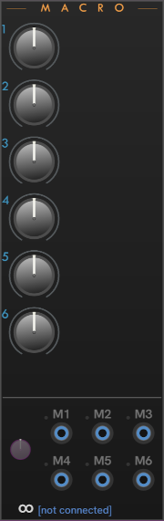

# CHEM Macro

**Macro** provides access and CV control for the classic macros on the Eagan Matrix.

| | |
| -- | -- |
| Unconnected (state when added to Rack alone) | **Core**-connected **Macro**, with cables modulating macros M1, M2, and M3. Pedal 2 is assigned to Macro 3, which is shown with the `p2` annotation. |
|  |  |

The M3 input in this illustration has a green light to indicate that the **Modulation amount** knob adjusts the M3 input.
To adjust modulation on another input, click on or near the jack, such as on the jack label.
The light will shift to that jack, and the modulation knob changes position to reflect the amount of modulation on that input.

The modulation inputs and **Amount** knob work the same across all CHEM modules.
See [CHEM Modulation](./modulation.md#chem-modulation-voltage-control) for details.

---

// Copyright © Paul Chase Dempsey\

