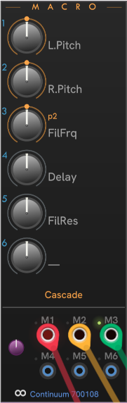

# CHEM Macro

**Macro** provides access and CV control for the classic macros on the Eagan Matrix.

| | |
| -- | -- |
| Unconnected (state when added to Rack alone) | **Core**-connected, with cables modulating macros M1, M2, and M3 |
|  |  |

---

// Copyright © Paul Chase Dempsey\

