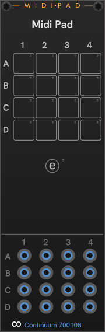

# CHEM MidiPad

Each *MidiPad** instance lets you define up to 16 Pads that can send a wide range of EaganMatrix (EM) configuration commands.
This is useful for things not covered in a dedicated CHEM modules, and designed to be basic support for Overlay Synths
(see [Overlay and XM](./overlay-xm.md#chem-overlay-and-xm) for mor einformation).

The EaganMatrix is controlled entirely by MIDI, and this module has special knowledge of the unique MIDI protocol used in the EM.

This is an advanced module, so you'll need to get technical to define the MIDI stream to be sent.
You will need to have the _Continuum User Guide_, the `HakenMidi.h` or `HakenMidi.pdf`,
or one of Richard Kram's fine technical guides at hand to define useful MIDI streams for your pads.

The MIDI definition is text-based using what I've dubbed the "Haken Control Language", or HCL.
The reference for HCL is here: [HCL: Haken Control Language](.\hcl.md#hcl_haken_control_language).

Here is a connected MidiPad with no pads defined yet:

The input ports are triggers for the respective pad.
Clicking a pad or receiving a trigger on the input port sends the MIDI associated with the pad.
Undefined pads are shown empty (just a frame), and the light is off.

Click the **e** button to enable editing mode.
The module expands with a flyout to the right (pushing any adjacent modules).

- At the top, enter a title for this set of pads (if you like).
- The coordinates of the selected pad are shown above the name entry.
  To select a pad for editing, click it. The selected pad is highlighted and its light comes on.
- Give the pad a name using the **Name** edit box. The default name for a new pad is it's coordinate.
- You can choose a color for the name text and for the pad itself by clicking the palette buttons.
- The large edit are in the middle is for your MIDI definition, expressed in [HCL](./hcl.md).
  - When the definition begins with a comment (text in quotes) before anything else, that comment is used in the tool tip for the pad.
- The three buttons below the MIDI definition. Allow you **clear** the pad definition and start over, **compile** the HCL you've entered, and **send** the MIDI you've defined to check that it does what you want it to do.

Below, we have given the module a title, and defined three pads.
 We're editing the A1 pad.

Here, the definition begins with a comment describing what the pad does.
This text is shown in the pad's tooltip, so you are reminded of what it does when clicked.
A descriptive comment is optional.
Comments after any MIDI is not shoiwn anywhere when running - it is just part of the pad definition.

To stop editing, click the close button (**x**) at the top-right of the flyout, or click the **e** button that you used to begin editing.

The syntax of HCL is not checked on the fly as you type.
Click the **compile** button, or press Ctrl+Enter to compile the definition.
If there are errors, the error is displayed below the buttons.
Selecting another pad or closing the flyout will automatically compile with any changes you've made.
When not editing, a pad with an erroneous definition will have a red light, and the error will appear in the tooltip for the pad.

---

// Copyright © Paul Chase Dempsey\

