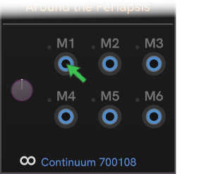
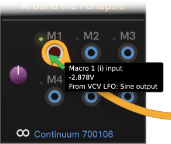
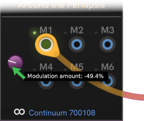

# CHEM Modulation (voltage control)

CHEM applies a common means to work with modulation.
To avoid clutter in the user interface, each module has a single **Modulation amount** knob in the input area to control how much modulation is applied for a given CV input. When no cables are connected, the **Modulation amount** knob is disabled.

| Unconnected | Connected | Modulated |
| :--: | :--: | :--: |
|  |  |  |

Only one jack at a time is controlled by the modulation knob.
Whenever you plug in a new cable, the light next to the jack lights up, the **Modulation amount** knob becomes enabled, and is automatically linked to the newly-connected jack.
When you disconnect a cable, the knob automatically switches to another connected jack.

The modulation amount for a new cable always starts at zero (centered knob), and can be adjusted from -100% to 100%.
A negative amount inverts the input voltage.

Modulation signals are assumed to be bipolar -5v to 5v, per the VCV Rack voltage standards.

To select a different connected jack for adjusting modulation, click the jack or somewhere near the jack, such as on it's label (if it has one).
The previous light (if any) will go off, and your clicked jack's light will come on.
The Modulation amoutn knob changes position to indicate the current modulation amount for that input.

---

// Copyright © Paul Chase Dempsey\

