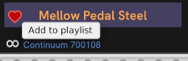
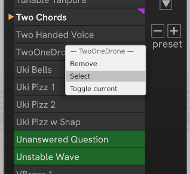
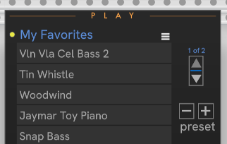
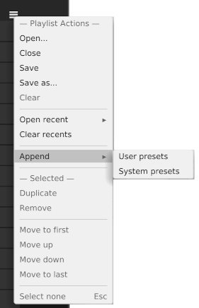

# CHEM Play

The **Play** module lets you create a playlist -- a selection of presets on your EM device.
You can call playlists "favorites" or "set lists".

In this image, **Play** is connected to a **Core** module controlling a Continuum, and has newly populated the playlist with User and System presets.
The yellow light indicates that the list hasn't been saved to disk.

Once you have a list of presets, click the name of the preset in the list to load it on the EaganMatrix device.

> **Important** —
> Most of the keyboard controls you'd expect to use for navigating, selecting, and editing are reserved by VCV Rack.
> These include Delete, Page Up, Page Down, Arrow keys, etc., so take care.
> Your interactions with Play are mouse-driven.

When connected, the live preset on your device is shown in the box below the playlist.
Click the **Heart** (favorite) button to add the live preset to your playlist.

Make sure to save your changes! When your playlist has been modified, the yellow light next to the playlist name comes on.

The **Up** and **Down** buttons page through the playlist.

The triangle to the left of a preset indicates that it is the **current** preset. **Next** and **Previous** are relative to the **current** preset.
The flag in the upper-right-hand corner indicates that it is the **live** preset.
This is the preset currently 'live' and playable on your device.

The **-** / **+** buttons advance to the previous/next preset in the list relative to the _active_ preset, making that preset the live preset on your device.
The two inputs at the bottom-right are trigger inputs for previous/next.

In the right click _module_ menu, select **Track live preset** to keep the **current** and **live** items in sync (as long as the live preset is present in your playlist).
With tracking enabled, you can change presets on yopur device or using a separate controller, and Play will keep in sync, automatically scrolling to the live preset if it's in your playlist.

You can toggle the current preset, select, and remove a preset using the right click _preset_ menu.
In this image, _TwoOneDrone_ has been right-clicked, and the menu items will apply to _TwoOneDrone_.
The **current** and **live** _Two Chords_, and the selected _Unanswered Question_ and _Unstable Wave_ are not afffected by the menu choice.

### The Play "hamburger" menu

More options for populating and editing a playlist are in the "hamburger" menu at the top right of the preset list.
You can add all User presets and system presets to the list.
If you don't want that many, you can edit the list down.

### Selection

Simple clicking loads the preset, so if you want to move or remove presets in the list, we use a different gesture.
When hovering over the right edge of a slot in the list, an overlay tab appears under your cursor.

Click the tab to select the preset.

Once you've made a selection, the Play menu provides options to duplicate, remove, or move the selection, up, down, to the beginning, or to the end.

Take note that you may have the intuition to press the Delete key to delete an item, but that doesn't work.
Rack removes the Play module from your patch instead.

You can also drag and drop.

To drag, press and hold the mouse button until the drag frame appears:

Continue holding the mouse button to drag to the point where you want to insert the selected items.
Here, the selected Music boxes will be moved to just after Mr Kyte.

---

// Copyright © Paul Chase Dempsey\

