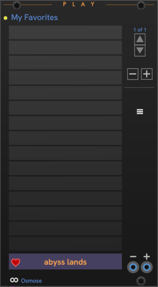
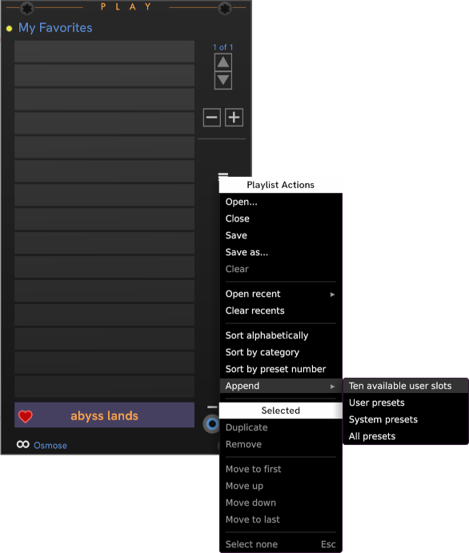
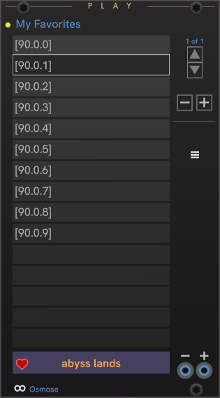
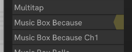
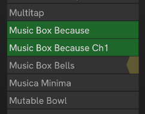
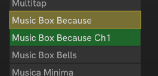
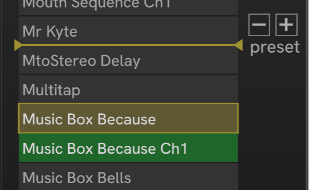

# CHEM Play

The **Play** module lets you create a playlist -- a selection of presets on your EM device.
You can call playlists "favorites" or "set lists".
A Play module's playlist is similar in purpose but unconnected to the Osmose playlist feature.

In this image, **Play** is connected to a **Core** module controlling an Osmose, with the _abyss lands_ preset loaded.
The yellow light indicates that the list hasn't been saved to disk.

When connected, the live preset on your device is shown in the box below the playlist.
Click the **Heart** (favorite) button to add the live preset to your playlist.
Make sure to save your changes! When your playlist has been modified, the yellow light next to the playlist name comes on.

Once you have some presets on your set list, click the name of the preset in the list to load it on the EaganMatrix device.

> **Important** —
> Most of the keyboard controls you'd expect to use for navigating, selecting, and editing are reserved by VCV Rack.
> These include Delete, Page Up, Page Down, Arrow keys, etc., so take care.
> Your interactions with Play are mainly mouse-driven.

The **Up** and **Down** buttons page through the playlist.

The triangle to the left of a preset indicates that it is the **current** preset. **Next** and **Previous** are relative to the **current** preset.
The flag in the upper-right-hand corner indicates that it is the **live** preset.
This is the preset currently 'live' and playable on your device.

The **-** / **+** buttons advance to the previous/next preset in the list relative to the _active_ preset, making that preset the live preset on your device.
The two inputs at the bottom-right are trigger inputs for previous/next.

In the right click _module_ menu, select **Track live preset** to keep the **current** and **live** items in sync (as long as the live preset is present in your playlist).
With tracking enabled, you can change presets on yopur device or using a separate controller, and Play will keep in sync, automatically scrolling to the live preset if it's in your playlist.

You can toggle the current preset, select, and remove a preset using the right click menu on a slot.

### The Play "hamburger" menu

Options for managing a playlist are in the "hamburger" menu at the top right of the preset list.

The _Append_ submenu has some great shortcuts for building a playlist.
If you have already scanned the available user and system presets using the **Core** module, you can append the entire User, System, or both lists to your playlist, then edit from there.

Another interesting option, especially on Osmose, is _Ten available user slots_.
This adds ten blank slots by id to the list. The result looks like this:

Each slot may or may not have a preset on your instrument yet.
When you click one, Play sends your instrument the codes to select the preset in that slot.
When a preset is present in that slot, the instrument loads it, and the entry in Play is automatically updated to reflect the preset that's there.

This option can be a more convenient way to build a list of your Osmose user presets than by the scanning process.

This self-updating behavior when selecting presets works in all the Preset lists in CHEM.
If your playlist or preset databases fall out of sync with changes you've made on the device, the lists in CHEM will sync up as you select a slot, so don't be suprised when the name of a preset changes in CHEM when you select it -- this is the self-healing feature at work.

If you notice you're out of sync, it's time to do a new scan from **Core** when you have the free time.

### Selection

Simple clicking loads the preset, so if you want to move or remove presets in the list, we use a different gesture.
When hovering over the right edge of a slot in the list, an overlay tab appears under your cursor.

Click the tab to select the preset.

Once you've made a selection, the Play menu provides options to duplicate, remove, or move the selection, up, down, to the beginning, or to the end.

Take note that you may have the intuition to press the Delete key to delete an item, but that doesn't work.
Rack removes the Play module from your patch instead.

You can also drag and drop.

To drag, press and hold the mouse button until the drag frame appears:

Continue holding the mouse button to drag to the point where you want to insert the selected items.
Here, the selected Music boxes will be moved to just after Mr Kyte.

---

// Copyright © Paul Chase Dempsey\

