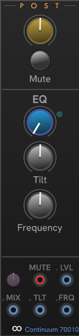

# CHEM Post

**Post** contains the post-section of the Eagan Matrix, not including convolutions, which are covered in the [**Convo**](./convo.md) module.

The Yellow knob at the top is overall volume level.
Below the **Post-Level** knob is a global **Mute** button that immediately silences all audio from the device.
The **Mute input** (red jack) allows you to mute your device with a trigger CV.

The Blue knob controls the mix of straight signal with equalization (EQ).

The modulation inputs and **Amount** knob work the same across all CHEM modules.
See [CHEM Modulation](./modulation.md) for details.

---

// Copyright © Paul Chase Dempsey\
