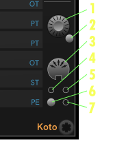
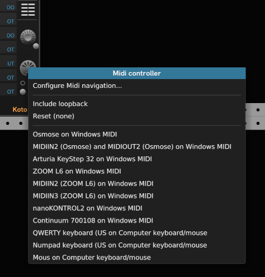
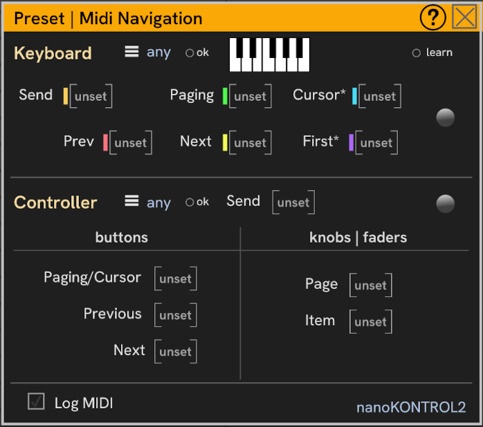
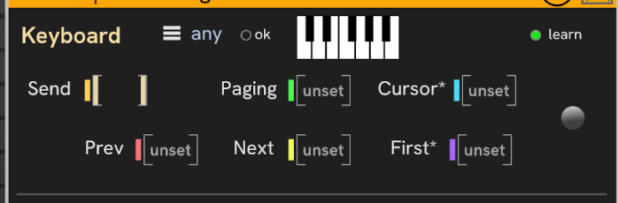
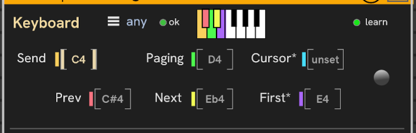
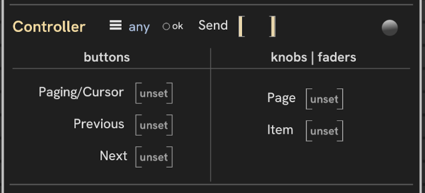
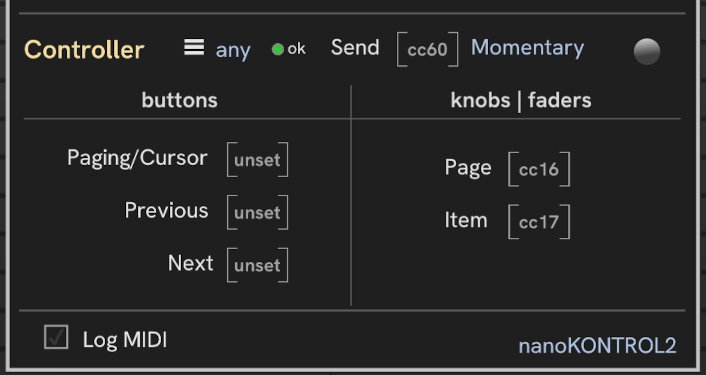

# Alternate preset navigation

_New in CHEM 2.03_

In addition to using the computer keyboard or mouse, **Preset** supports navigation using a knob or an external Midi keyboard or controller.

The preset navigation section on the lower right has the folllowing controls:

| Callout | Control/Light | Widget | Description |
| -- | -- | -- | -- |
| **1** | Navigate Presets | knob | Turn the knob to scan through presets, similar to pressing Up and Down arrow keys. Ctrl+Shift+Drag for precise movement. Click the knob to send the selected preset. Provided primarily for automation via a mapping module. |
| **2** | Select Preset | button | Send the selected preset to the instrument. Same effect as clicking the knob. Provided primarily for automation via a mapping module. |
| **3** | Midi Navigation | button | Click to select a Midi keyboard or controller, and to configure your MIDI device for naviation. |
| **4** | Keyboard paging | light | When configured, Green for Paging mode, and blue for Cursor mode |
| **5** | Controller paging | light | When configured, Green for Paging mode, and blue for Cursor mode |
| **6** | Mute keyboard | button | Mute navigation input from the keyboard, so it can be played without navigating presets. |
| **7** | Mute keyboard | light | Lit when keyboard navigation is muted. |

Click the _Midi Navigation_ button (**#3**) to select a Midi device for preset navigation. The device you select must be configured, so after connecting to your keyboard or controller, choose _Configure Midi Navigation_ from the menu.

There are many loopback devices, so they aren't listed by default.
Choose _Include loopback_ to include the loopback devices in the menu.

To forget or disconnect a device, choose _Reset_.

The configuration dialog looks like this:

Without a connection, all the Learn boxes on the dialog show red (not shown).

Configuring each action is done by way of Midi Learn.
Click between the brackets in the learn box next to an action, then activate the corresponding control on your controller.
When learning is active, the _learn_ light is lit and the active learn box gets wide green brackets.
Press a button, twist a knob, or slide a fader to learn it's Midi Note number or Midi CC code and what kind of controller it is.

If you have a controller that sends notes for buttons or pads, use the Keyboard section to configure it.

Once a learn box is active, you can use TAB and Shift+TAB to move between learn boxes.
Pres ESC to clear a setting and start anew.

The round buttons to the right of each section are Reset buttons for the section.
Click _Reset_ to clear all the settings for the section.

## Keyboard navigation

Keyboard navigation uses Midi Note On to trigger a navigation action.
Press the key to take the action.
The concept is the same as using keyswitches in DAWs/VSTs for selecting parameters.

In this image, I've clicked in the learn box for _Send_, but I haven't pressed a key on the keyboard yet.
The _learn_ light is lit, and the _send_ learn box has thick bars.

- The Hamburger menu lets you select the specific channel to listen on, or leave it as _any_.
- The _ok_ light shows green when a valid complete configuration is set. A partial or invalid configuration shows red. Items with an asterisk (`*`) are optional.
- The little keyboard at the top is only for display.
- The _learn_ light shows when learing is active in either the Keyboard or Controller sections.
- The round button at the right is the _Reset_ button to clear the keyboard configuration and start over.

When I press the lowest C on my Keystep, CHEM auto-fills settings for the cluster starting at C4.
These automatic settings are active only for C and F in a blank keyboard configuration. See [Quick Config](#quick-config) below for details.

.

| Action | Description |
| -- | -- |
| Send | Send the preset at the cursor to the instrument. |
| Paging | Prev/Next move the cursor by pages. |
| Cursor | Prev/Next move the cursor by preset within the page. |
| Previous | Move cursor to the previous page or index. |
| Next | Move cursor to the next page or index. |
| First | Move the cursor to the item given by the distance from the _First_ key. |

You can choose one key for toggling the paging/cursor mode, or two keys, each setting a particular mode.

Configure toggling by selecting the same key for both _Paging_ and _Cursor_, or by configuring only one of them, leaving the other blank.

Clicking between square brackets activates Midi learn for that item.
When learn mode is active, press a key to assign that note.
To clear an entry, press **ESC**.
To exit learn mode click empty space on the dialog.

_First_ is optional and can be left unconfigured (unset).
In page mode, a ranged action goes directly to a page, and in Index mode goes to the zero-based offset from the start of the page.
The range is configured by specifying the _First_ key.
All the remaining keys on the keyboard to the right of the selected _First_ key are active.

One typically uses the lowest keys on the keyboard for keyswitches.

### Quick Config

For convenience, there are two quick keyboard configurations.
From an empty configuration, click in the _Send_ learn box, and press:

| Note | Configuration |
| -- | -- |
| **F** | **F** send, **F#** paging mode **Ab** cursor mode, **G** previous, **A** next, **Bb** first |
| **C** | **C** send, **D** toggle paging/cursor, **C#** previous, **Eb** next, **E** first |

If you don't like the quick configuration, you can reset or simply click in the learn boxes and play the keys you want for each function.

## Controller navigation

Knobs and faders are interchangeable from the MIDI perspective, so we'll always refer to "knobs" here.

- The Hamburger menu lets you select the specific channel to listen on, or leave it as _any_.
- The _ok_ light shows green when a valid complete configuration is set. A partial or invalid configuration shows red. Items with an asterisk (`*`) are optional.
- The _learn_ light at the top of the dialog shows when learing is active in either the Keyboard or Controller sections.
- The round button at the right is the _Reset_ button to clear the controller configuration and start over.

In this image, I've clicked in the learn box for _Send_, but I haven't pressed a button, turned a knob, or moved a fader.
The _learn_ light is lit, and the _send_ learn box has thick bars.

Send can be activated by any kind of controller.
A button is intuitive and straightforward,
but how do you launch an fixed action with a continuous knob or fader?
There are various ways this could be set up.
To keep things simple, I've decided that the action is taken when the knob or fader passes the middle value.
This is usually with the knob indicator straight up.
When passed going up, the action is taken and you leave it up.
The next time you want to take the action, turn it back.
So, it's just a matter of flipping it back and forth, like a light switch.

CHEM automatically learns what kind of control it is, and does the right thing for activating _Send_, whehter it's a continuous controller, a momentary button, or a toggling (latching) button.

You have a choice to configure only the buttons section or only the knobs section (along with Send, of course).

My favorite configuration is _Send_ plus two knobs for _Page_ and _Item_. This uses the fewest number of controls on the device and is the fastest way to get around the preset list.
it looks like this:

You can configure a knob or fader to act as a button in the buttons section, but only continuous controls can be used for the knobs/faders section.

On some controllers, latching lights the button, so this is a good choice for the _Paging/Cursor_ toggle so that you can see which mode you're in at a glance.
