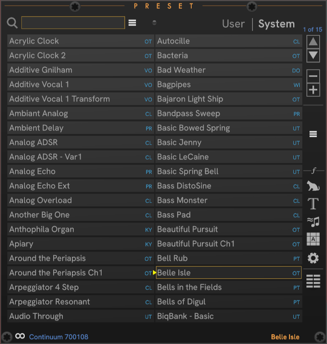
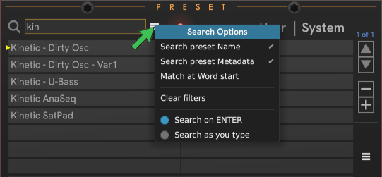
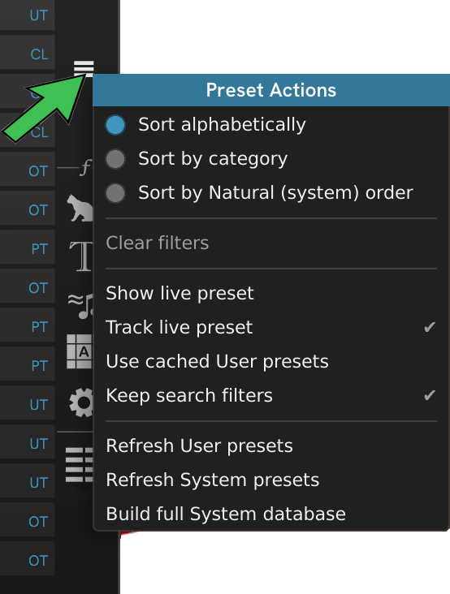
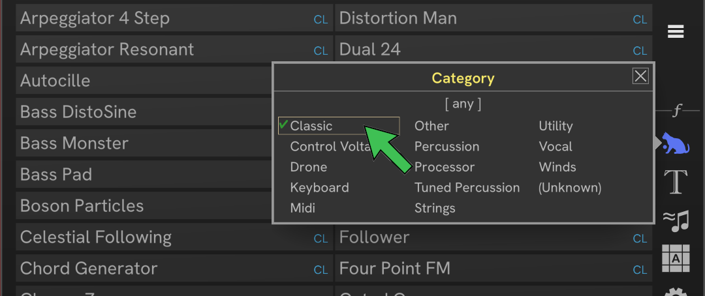

# CHEM Preset

**Preset** provides fast access to the presets installed on your device.

When starting to use a new EaganMatrix device or first using CHEM Preset and Play,
you must first manually build databases for System and User presets on the device.
The process of building the databases can take a significant amount of time (which is why it isn't automatic).
This can take nearly an hour on Osmose for System presets.

Scanning System and User presets is initiated from the [**Core** module](./core.md#chem-core) **Core actions menu**.
See the [**Core** module documentaiton](./core.md#chem-core) for details.

## Preset search

Searching presets is fast and easy using the search box at the top of the module.
Type some text, hit ENTER, and only matching presets are shown.
This is a case-insensitive free-text search of preset names and raw metadata (by default).
You can tune how you want to search by clicking the **Search options** hamburger menu to the right of the search box.

- You can choose to search only preset names, only metadata, or both (the default). At least one must be selected.
- **Match at Word start** lists only matches that occur at the start of a word or code in the name or metadata (prefix match).
- **Clear filters** clears all metadata filters and search text.
- Choose to **Search on ENTER** (the default) or **Search as you type** (incremental search) to update the list for each character you type or any other change in the edit search box.

Keyboard is the focus for searching, so these gestures are available for preset navigation from the keyboard:

- Press **ESC** to clear the search text. Focus remains in the search box so that you can type something else.
- Press **TAB** to move to the preset list, where you can navigate the (filtered) list using the keyboard.
- From the preset list, press **TAB** or **Shift+TAB** to move back to the search box.
- In the preset list, the usual navigation controls work: Up, Down, Left, Right, Page Up, Page Down, Home, End, with Ctrl+_key_ modifiers.
Press **ENTER** in the preset list to load the current preset.

Metadata includes only Category codes and not the attribute names, so you must type the codes to get metadata search results.
See the [Metadata Code Reference](#metadata-code-reference) for more information.

For a given device, there may be no presets with a defined metadata tag, so filtering or searching may return no results.
This is expected.
For example, most EM devices contain no presets tagged with **DP** (Demo Preset).

A "Quick scan" of presets does not include all metadata.
For example, Category information is available, but Author information is not included.

## Preset actions menu

The "hamburger" menu on the right is the *Preset Actions* menu.

| Menu item | Description |
| -- | -- |
| **Sort alphabetically** | Sort the presets alphabetically. This is the default. |
| **Sort by category** | Sort the presets by Category, then alphabetically within the category. Categories are order alpha by category code: (**CL** Classic, **CV** Control Voltage, **DO** Drone, **KY** Keyboard, **MD** Midi, **OT** Other, **PE** Percussion, **PR** Processor, **PT** Tuned Percussion, **ST** Strings, **UT** Utility, **VO** Vocal, **WI** Winds, **ZZ** (Unkown)). If you see any presets in the **ZZ** category, the preset has an authoring error. |
| **Sort by Natural (system) order** | Arrange the presets in the system order. This is the same order that presets are loaded when using the *Previous*/*Next* buttons on the **Core** module. |
| **Show live preset** | Scrolls the *live* preset into view. |
| **Track live preset** | The *current* preset follows the *live* preset. |
| **Keep search filters** | When enabled, metadata filters are retained across invocations of Rack with the same Rack patch. If not enabled, each invocation starts fresh with all presets shown. |

## Right-side controls

The controls on the right side of the module are:

| Control | Description |
| -- | -- |
|**Page Up**| Ctrl+Click to go to page 1. |
|**Page Down**| Ctrl+Click to go to the last page. |
|**Previous preset**| Load the Previous preset, relative to the *current* preset (the one with the yellow arrow). If no *current* preset has been set, this is relative to the *live* preset. |
|**Next preset** | Load the Next preset, relative to *current*. |
|**Preset Actions** menu | General menu for the module. Don't forget there's also the usual Right click module menu for managing the theme. |
|**Category** filter | Select which preset Categories are shown in the tab. |
|**Type** filter | Select which preset Types are shown in the tab. These are things such as **Atonal**, **Bowed**, **Brass**.  |
|**Character** filter | Select which preset Characters are shown in the tab. These are attributes such as **Acoustic**, **Nature**, **Metallic**. |
|**Matrix** filter | Select which preset Matrix componentsattributes are shown in the tab. These include **BiqBank**, **HarMan**, and **OSC Jenny** |
|**Setting** filter | Select which preset Setting are shown in the tab. These include **Rounding** and **Touch Area**. |
|**Clear filters** | Clear all metadata filters and any search text. |

## Filtering

The filter dialogs all work the same, like the Category filter dialog shown here:

- Click the Category to select which presets to show. In this screen snip, the presets are filtered by Classic category (**CL**).
- You can choose as many categories as you like.
- Click **[ any ]** to not filter at all.
- Ctrl+click to choose just the clicked category. Any other enabled category is cleared.

When any filtering is active, attribute or search text, the red light above the preset listcome son and the **Clear filters** button and menu items become active.

## Custom playlists

You can maintain custom playlists using the [**Play**](./play.md#chem-play) module, so it can be useful to have **Play** and **Preset** next to each other.
Use **Preset** to find the preset you want and select it as the *live* preset. In **Play**, you can click the **Favorite** (heart) button to add that preset to the playlist.
Make sure to save your playlist before closing Rack or loading another Rack patch. You are *not* prompted to save a modified playlist.

## Metadata code reference

| Code | Group | Name |
| -- | -- | -- |
| **CL** | Category| Classic |
| **CV** | Category| Control Voltage |
| **DO** | Category| Drone |
| **KY** | Category| Keyboard |
| **MD** | Category| Midi |
| **OT** | Category| Other |
| **PE** | Category| Percussion |
| **PR** | Category| Processor |
| **PT** | Category| Tuned Percussion |
| **ST** | Category| Strings |
| **UT** | Category| Utility |
| **VO** | Category| Vocal |
| **WI** | Category| Winds |
| **ZZ** | Category| (Unkown) |
| **AT** | Type| Atonal |
| **BA** | Type| Bass |
| **BO** | Type| Bowed |
| **BR** | Type| Brass |
| **DP** | Type| Demo Preset |
| **EP** | Type| Electric Piano |
| **FL** | Type| Flute |
| **LE** | Type| Lead |
| **OR** | Type| Organ |
| **PA** | Type| Pad |
| **PL** | Type| Plucked |
| **RD** | Type| Double Reed |
| **RS** | Type| Single Reed |
| **SU** | Type| Struck |
| **AC** | Character| Acoustic |
| **AG** | Character| Aggressive |
| **AI** | Character| Airy |
| **AN** | Character| Analog |
| **AR** | Character| Arpeggio |
| **BG** | Character| Big |
| **BI** | Character| Bright |
| **CH** | Character| Chords |
| **CN** | Character| Clean |
| **DA** | Character| Dark |
| **DI** | Character| Digital |
| **DT** | Character| Distorted |
| **DY** | Character| Dry |
| **EC** | Character| Echo |
| **EL** | Character| Electric |
| **EN** | Character| Ensemble |
| **EV** | Character| Evolving |
| **FM** | Character| FM |
| **HY** | Character| Hybrid |
| **IC** | Character| Icy |
| **IN** | Character| Intimate |
| **LF** | Character| Lo-fi |
| **LP** | Character| Looping |
| **LY** | Character| Layered |
| **MO** | Character| Morphing |
| **MT** | Character| Metallic |
| **NA** | Character| Nature |
| **NO** | Character| Noise |
| **RN** | Character| Random |
| **RV** | Character| Reverberant |
| **SD** | Character| Sound Design |
| **SE** | Character| Stereo |
| **SH** | Character| Shaking |
| **SI** | Character| Simple |
| **SO** | Character| Soft |
| **SR** | Character| Strumming |
| **SY** | Character| Synthetic |
| **WA** | Character| Warm |
| **WO** | Character| Woody |
| **AD** | Matrix| Additive |
| **BB** | Matrix| BiqBank |
| **BH** | Matrix| BiqGraph |
| **BM** | Matrix| BiqMouth |
| **CM** | Matrix| Cutoff Mod |
| **DF** | Matrix| Formula Delay |
| **DM** | Matrix| Micro Delay |
| **DS** | Matrix| Sum Delay |
| **DV** | Matrix| Voice Delay |
| **HM** | Matrix| HarMan |
| **KI** | Matrix| Kinetic |
| **MM** | Matrix| ModMan |
| **OJ** | Matrix| Osc Jenny |
| **OP** | Matrix| Osc Phase |
| **OS** | Matrix| Osc DSF |
| **SB** | Matrix| SineBank |
| **SS** | Matrix| SineSpray |
| **WB** | Matrix| WaveBank |
| **C1** | Setting| Channel 1 |
| **EM** | Setting| External Midi Clock |
| **MI** | Setting| Mono Interval |
| **PO** | Setting| Portamento |
| **RO** | Setting| Rounding |
| **SP** | Setting| Split Voice |
| **SV** | Setting| Single Voice |
| **TA** | Setting| Touch Area |

---

// Copyright © Paul Chase Dempsey\

