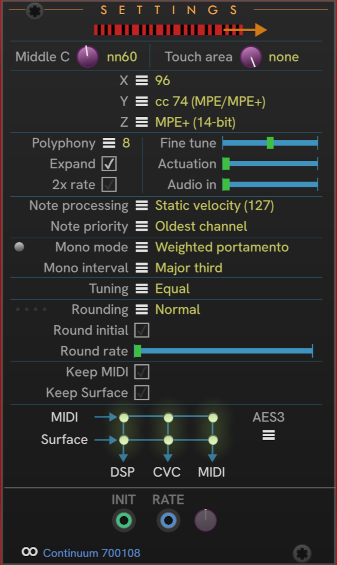

# CHEM Settings

Use **Settings** to control Eagan Matrix settings not available in the other CHEM modules.

Click the **fingerboard** to reverse the direction of the playing surface.

Next select the **X** (bend range), and the **Y** (front-back) and **Z** (pressure) MIDI cc assiignments. The last section for **X** is a combination with MPE (96) for MPE channels 2+, and a selected range on Channel 1.

**Note processing** lets you determine how notes are processed, including the MIDI *Note On* velocity:

| Option | Description |
| -- | -- |
| **Static velocity** | All notes have a static velocity of 127, the maximum. |
| **Dynamic velocity** | Calculated from the initial attack on the fingerboard. |
| **Formula velocity** | Calculated using EM formula V. |
| **No notes** | Supresses all production of MIDI notes. |
| **Ethervox** | All note information is a pitch bend from MIDI Note 60 (middle C). |
| **Kyma** | Special mode for controlling a Symbolic Sound Kyma device. |

The **Mono** button turns Mono mode on and off.

The **Mono mode** menu offers a variety of modes for how a note transitions from one to another when Mono mode is on.

**Mono Interval** controls the interval from the first note where the mono behavior takes effect.
The default is off, where Mono applies across the entire playing surface when Mono is on.

The **Tuning** menu selects the tuning for notes from the playing surface.
Choose from *n*-TET (equal) tunings,
Just intonation for selected scales,
or custom tunings created using the 3rd-party *Pitch Table Editor* (PTE).
See the Haken Audio documentation for more information on using the PTE.

The **Rounding** menu offers choices for when round is applied.

The **Round Initial** check box controls the obvious thing.

The **Round rate** slider controls the rounding rate from 0 (none) to 10 (fastest).
The selected rounding rate can be modulated using the **RATE** input.

The **Keep MIDI** check box is the equivalent of *Preserve MIDI* in the Haken Editor's *Global Settings*.

The **Keep Surface** check box is the equivalent of *Preserve Surface* in the Haken Editor.

The equivalent to the HE *Preserve Pedals* setting is on the [**Jack** module](./jack.md).

## Inputs

The **INIT** input accepts a unipolar 0 to 10v gate to control the **Round Initial** setting.
When the gate is high, Round Initial is on.
When the gate is low, Round Initial is off.

The **RATE** input is a bipolar (-5 to +5v) modulation of the selected **Round rate**.

---

// Copyright © Paul Chase Dempsey\

