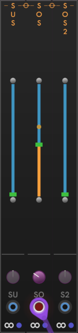

# CHEM Sustain, Sostenuto, and Sostenuto 2

The **Sustain**, **Sostenuto**, and **Sostenuto 2** modules provide on-screen "pedals" for these functions.
These modules are unaffected by any pedal assignments made in [**Jack**](jack.md).
They are always Sustain and Sostenuto.
If you have a pedal connected and assigned to one of these functions, these modules reflect the dynamic pedal position.

Click the round button on either end of the slider to jump directly to the maximum or minimum value. Clicking anywhere along the slider jumps to the clicked position.

Here we see **Sostenuto** (Sos) with a cable connected to the modulation input, and the modulation amount at about -37%.
The scroll thumb shows the "pedal" position.
 When modulated, the dot shows the effective modulated value.
The purple knob controls the amount of modulation ("strength" of CV influence), from -100 to 100%.

## Mouse and keyboard

The mouse scroll wheel works on these sliders. Shift+Scroll goes faster.

The sliders support keyboard access when the mouse is over the slider:

- **HOME** and **END** jump to maximum and minimum.

- **UP** and **DOWN** arrows increase and decrease the value. **SHIFT+Arrow** goes faster.

- **0** — **9** keys jump to the proportional value, from nothing to maximum.

---

// Copyright © Paul Chase Dempsey\

