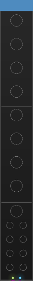
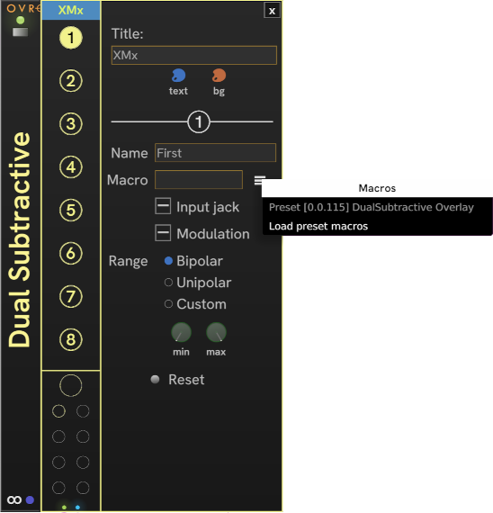
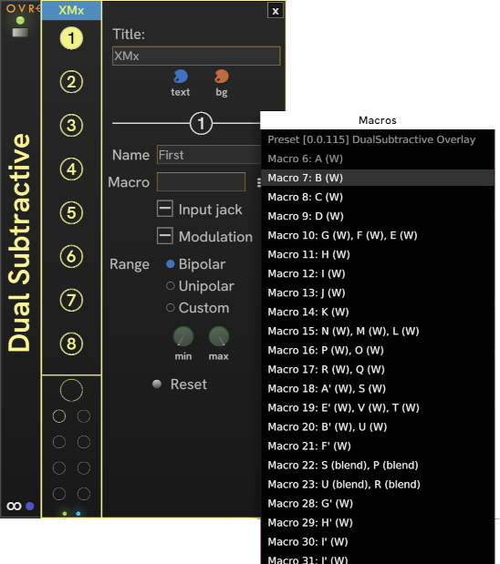
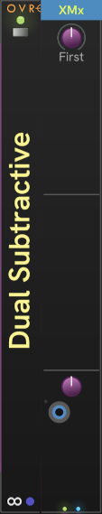

# CHEM XM

**XM** (a.k.a. _Extended Macro_) works with a companion [**Overlay**](./overlay.md#chem-overlay) module to control up to eight extended macros in an Overlay preset.

Each XM is linked to an Overlay. For the details on how Overlay and XM work together, see [Overlay and XM](./overlay-xm.md#chem-overlay-and-xm).

Unlike the typical Rack module with a fixed purpose for each control, XM is dynamic and requires you to configure each macro.

When first added to Rack, XM doesn't look like much becuase it hasn't been configured yet:

To configure XM, place it next to it's intended configured companion Overlay and toggle Edit mode using _Edit_ in the module right click menu, or press F2.
Communications with the EM are suspended while editing.

Edit mode opens a flyout panel to the right of XM.
In the edit panel you can configure a module Title, custom colors for the module header, and a macro.
Click the knob number on the left to select that slot for editing.
Each slot can configure a Name, the extended macro number from 7-90, the range of the macro, and the control mode of the slot.

The macros available for a preset are not immediately available in the menu.
Choose _Load preset macros_ to fill the menu.
Sometimes this doesn't work the first time, and you may need to try again, or even refresh the MIDI connection.
Once laoded, you'll have the macros, and their usage in formulas aavailable for selection:

It isn't necessary to load the preset's macros from the menu.
You can simply type in the macro number, from 7 to 90.

You can configure each macro for three modes of control:

| Control&nbsp;Mode | Description | Input&nbsp;jack | Modulation |
| -- | -- | :-: | :-: |
| Knob only | The macro value is set only by the knob. | no | no |
| CV-modulated | Modulation amount knob selects how much the CV on the input port affects the value of the knob. An animated modulation track appears around the knob, showing the effective value of the macro.| yes | yes |
| CV-driven | The macro value is the CV value, scaled to the macro's range. No knob is displayed, only an animated track that shows the value. | yes | no |

Click the _Reset_ button to clear the current macro.

Here's is Overlay and XM with one configured macro out of the possible 8:

To control more than 8 macros, add another XM.

All CV input is assumed to bipolar -5v to 5v per Rack standards.
For example, if you're using the **VCV LFO** module you'll usually turn off **OFST** (switch to Bipolar mode).

---

// Copyright © Paul Chase Dempsey\

